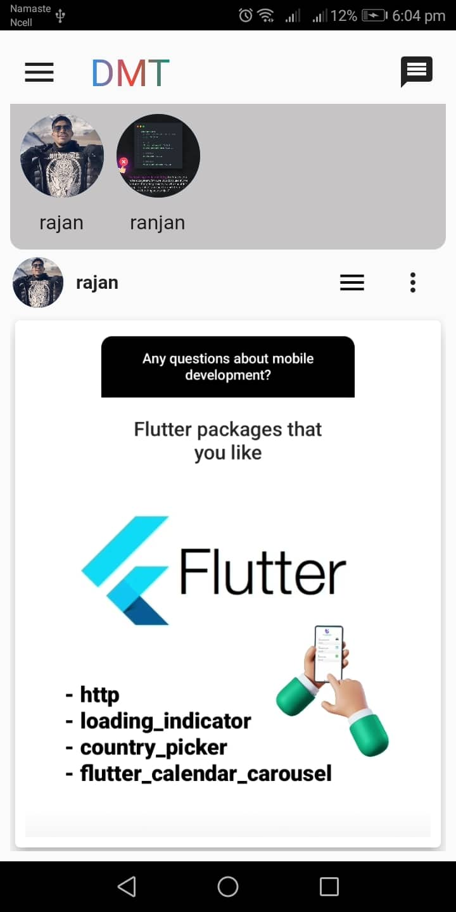

# Design Management Tool: DMT

A dengue app design with the help of Provider State Management (RiverPod).
DMT built with the help of Flutter and Dart as FrontEnd whereas Firebase has been used to built the backend and for the state management Provider and Riverpod were used.

## Getting Started

Design for the company to address every design and have their own app to store all the design . Actually it is built to maintain all the designs of the company and have a quick feedback and also have the like and comment option so that everyone in company can provide the feedbacks and comment. It has also a public chat system to chat with each other related to the designs and related to the work.It has feature to add new designer .

## ScreenShots:

